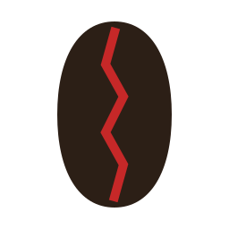
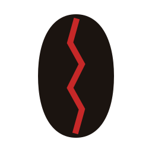
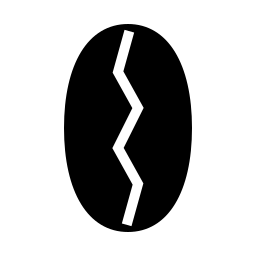
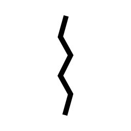
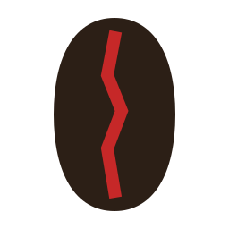
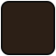
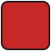
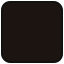

# Clawffee Brand Assets

  
  

This folder contains official Clawffee identity assets and governance files.

## Structure

- `brand/logo/`
  - `clawffee-mark.light.svg`
  - `clawffee-mark.dark.svg`
  - `clawffee-mark.mono.svg`
  - `clawffee-mark.invert.svg`
  - `clawffee-mark.favicon.svg`
- `brand/exports/png/`
  - `16.png`, `24.png`, `32.png`, `48.png`, `64.png`, `128.png`, `256.png`
- `brand/swatches/`
  - `bean-primary.svg`, `bean-dark.svg`, `seam-red.svg`, `mono-black.svg`, `mono-white.svg`
- `brand/BRAND_GUIDE.md`
- `brand/COLORS.json`

## Logo Variant Previews

| Variant | Preview | File |
| --- | --- | --- |
| Light |  | `brand/logo/clawffee-mark.light.svg` |
| Dark |  | `brand/logo/clawffee-mark.dark.svg` |
| Monochrome |  | `brand/logo/clawffee-mark.mono.svg` |
| Invert |  | `brand/logo/clawffee-mark.invert.svg` |
| Favicon |  | `brand/logo/clawffee-mark.favicon.svg` |

## Color Locks (Visual)

| Token | Hex | Swatch |
| --- | --- | --- |
| Bean Brown | `#2C1F16` |  |
| OpenClaw Red (Locked) | `#C62828` |  |
| Dark Bean | `#1B1410` |  |

Red must not drift in digital usage.

## Usage Rules

Refer to `brand/BRAND_GUIDE.md` for:
- clear space
- minimum size
- distortion restrictions
- monochrome usage
- future evolution constraints
